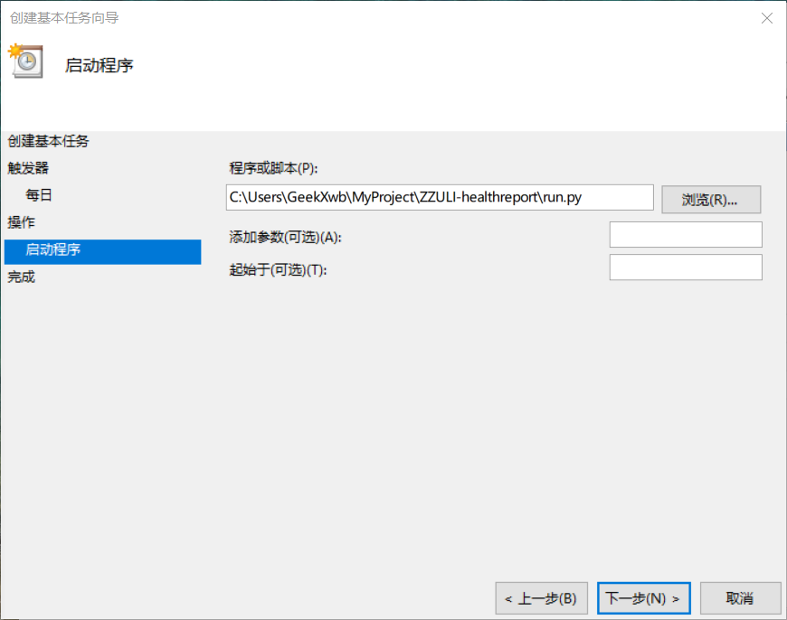

# 部署到Windows(两校区每晚断电，不推荐使用)
分为`Python环境配置`和`设置定时任务`两部分  
当设置定时任务之后，请保证在所定时间内Windows保持开机状态，如需要全自动打卡  
可以选择部署在`GitHub Action`  
或者通过原生环境或者Docker的方式部署到Linux服务器。

<hr />
本文写于Windows10 20H2 版本

👇👇👇教程👇👇👇

## 下载项目文件
打开项目仓库：[点我打开](https://github.com/billionray/ZZULI-healthreport)  
点击右上角的`Star`图标，然后点击`Code`按钮（绿色）后点击`Download ZIP`下载并解压本项目
## 配置Python环境
下载安装Python：[点我打开](https://npm.taobao.org/mirrors/python/) （这里使用的是阿里云镜像，当然也可以选择去官网下载） 
打开后选择Python版本  
>这里推荐Python3.7.6或Python3.9.1 这两个版本是经过测试的版本  

选择格式为：`Python-版本号.exe`的下载  
运行安装程序，并在安装时勾选`Add to PATH`的复选框
## 安装Python依赖
打开保存项目的文件夹  
按着`Shift键`在文件夹空白处右键  
选择`在此处打开powershell窗口`  
输入`pip install selenium requests`命令安装依赖

## 安装其他依赖
本项目需要Chrome及Chromedriver  
[点我下载Chrome](https://google.cn/chrome)  
查看Chrome版本  
打开Chrome，依次点击  
- 右上角三个点点的按钮  
- 帮助  
- 关于Google Chrome

记下Chrome版本号
[点我下载Chromedriver](https://npm.taobao.org/mirrors/chromedriver)  
选择相应的Chrome版本  
下载`chromedriver_win32.zip`  
解压并将chromedriver丢入`C:\Windows\System32`文件夹（丢入其他path记录的文件夹也可以）
## 修改配置文件
右键选择项目中的`data.json`文件  
打开方式选择记事本（如果使用富文本编辑器当然更好啦）
按照如下方式编辑，其中填入的值尽量与官方打卡页面显示的数据相同
```json
{
  "username": "", #填写学号
  "password": "", #填写i轻工大密码，默认zzuli+身份证后六位
  "mobile": "", #填写手机号
  "homemobile": "", #家庭电话
  "gpslocation": "", #GPS定位的地址，例如：XX省XX市XX区XX街道XX小区（选填）
  "lat": "0", #请将0修改为家庭住址纬度（可选修改项，若不想填，请不要修改0）
  "lon": "0", #请将0修改为家庭住址经度（可选修改项，若不想填，请不要修改0）
  "region": "", #校区 例：东风校区、科学校区、禹州实习训练基地、校外走读
  "area": "", #例：宿舍区 一区、二区、秋实区、丰华区
  "build": "", #例：楼号 5号楼、1号楼
  "dorm": "", #宿舍号（仅数字）
  "schoolgps": "", #学校GPS地址，详细一点，例如：河南省郑州市金水区郑州轻工业大学第二学生园区
  "schoollat": "0", #请将0修改为学校纬度 小数点后五位
  "schoollon": "0", #请将0修改为学校经度 小数点后五位
  "my_user": "", #收件人地址 
  "my_sender": "", #发件人地址
  "SMTPdomain": "", #发件人SMTP地址（SSL）
  "SMTPauth": "", #发件人SMTP授权码
  "noticetype": "" #是否需要邮件提醒，输入1为需要，0为不需要
}
```

## 测试运行
在powershell窗口执行`python3 run.py`  
如果出现`mission success`说明程序可以运行

## 设置Windows任务计划执行自动打卡

按下`Win+R`调出运行

输入taskschd.msc 打开任务计划程序

点击右侧`创建基本任务`

填入名称及描述

`触发器`设置为每天执行

并将开始时间设置为合适的时间

例如我设置的8点，就要保证每天8点电脑处于开机状态


`操作`设置为启动程序

点击右侧浏览选择`run.py`



依次点击下一步直至完成

